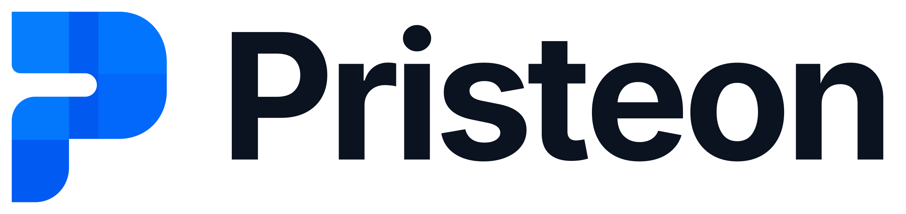

  <picture>
    <source media="(prefers-color-scheme: dark)" srcset="pristeon-logo-colour-light-text.png">
    
  </picture>

<strong>Software built to last.</strong>

Pristeon is an independent software studio founded in Accra, Ghana, building web and
mobile products for people and businesses everywhere. The name blends *pristine*
(pure, carefully made) and *aeon* (timeless): clean, reliable software designed to
stand the test of time.

We start small, build in public, and grow into new spaces as we find problems worth solving.

### What we're building
- 🚧 First product coming soon

### Follow along
- Founder: [Kwasi Antwi Baayeh](https://www.linkedin.com/in/kabaayeh)
